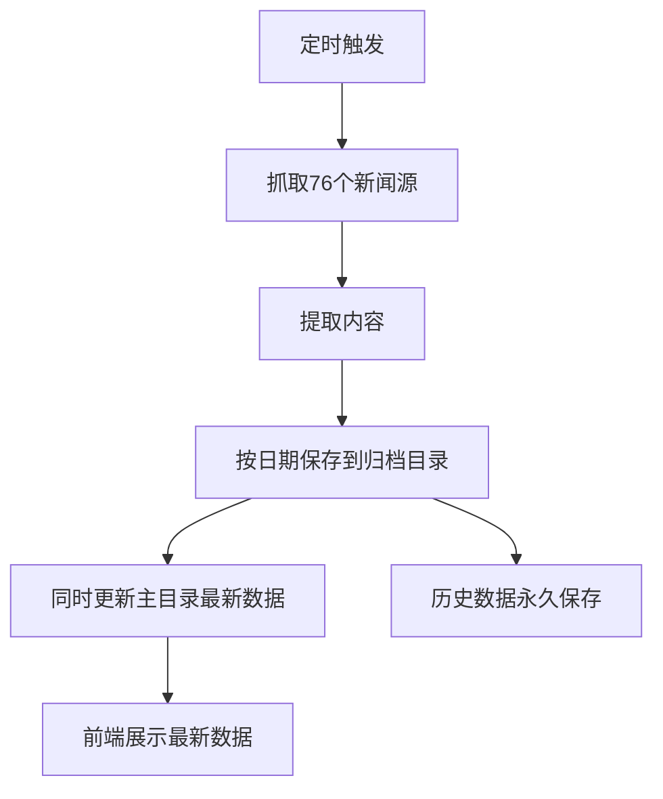

# 📚 按日期存储历史数据 - 使用指南

## 🎯 功能概述

已实现完整的**按日期归档**功能，可以：
- ✅ 自动按日期保存每天的新闻数据
- ✅ 保留历史记录，不会被覆盖
- ✅ 提供完整的历史数据查询API
- ✅ 支持日期范围查询和数据对比

---

## 📁 新的目录结构

```
data/
├── 2026-01-01/                    # 2026年1月1日的数据
│   ├── summary.json               # 汇总数据
│   ├── www.nejm.org_.json        # NEJM详细数据
│   ├── www.bmj.com_.json         # BMJ详细数据
│   └── ...                       # 其他76个源
├── 2026-01-02/                    # 2026年1月2日的数据
│   ├── summary.json
│   └── ...
├── 2026-01-03/                    # 2026年1月3日的数据
│   └── ...
├── summary.json                   # 最新数据（用于前端实时展示）
├── latest.json                    # 最新数据元信息
└── ...                           # 其他最新数据文件
```

### 数据说明

#### 历史归档目录 (`data/YYYY-MM-DD/`)
- 每天一个目录
- 永久保存，不会被覆盖
- 包含完整的抓取结果

#### 主目录 (`data/`)
- 存储最新一次抓取的数据
- 用于前端实时展示
- 每次抓取会更新

---

## 🔌 API 接口

### 1. 获取所有归档日期列表

**接口：** `GET /api/archives/dates`

**响应示例：**

```json
{
  "success": true,
  "count": 30,
  "dates": [
    {
      "date": "2026-01-03",
      "total": 76,
      "successful": 72,
      "failed": 4,
      "created": "2026-01-03T00:00:00.000Z",
      "modified": "2026-01-03T00:15:23.000Z"
    },
    {
      "date": "2026-01-02",
      "total": 76,
      "successful": 70,
      "failed": 6,
      "created": "2026-01-02T00:00:00.000Z",
      "modified": "2026-01-02T00:16:45.000Z"
    }
  ]
}
```

**前端调用示例：**

```typescript
async function getArchiveDates() {
  const response = await fetch('http://localhost:8888/.netlify/functions/api/archives/dates');
  const data = await response.json();
  console.log('可用的归档日期:', data.dates);
}
```

---

### 2. 获取指定日期的汇总数据

**接口：** `GET /api/archives/:date/summary`

**参数：**
- `date`: 日期字符串 (YYYY-MM-DD)

**请求示例：**

```bash
GET http://localhost:8888/.netlify/functions/api/archives/2026-01-01/summary
```

**响应示例：**

```json
{
  "success": true,
  "date": "2026-01-01",
  "data": [
    {
      "url": "https://www.nejm.org",
      "status": "success",
      "title": "The New England Journal of Medicine (NEJM)",
      "articles_count": 25,
      "links_count": 150,
      "from_cache": false,
      "timestamp": 1704067200000,
      "date": "2026-01-01"
    }
  ]
}
```

---

### 3. 获取指定日期的详细数据

**接口：** `GET /api/archives/:date/details/:filename`

**参数：**
- `date`: 日期字符串 (YYYY-MM-DD)
- `filename`: 文件名 (例如: `www.nejm.org_.json`)

**请求示例：**

```bash
GET http://localhost:8888/.netlify/functions/api/archives/2026-01-01/details/www.nejm.org_.json
```

**响应示例：**

```json
{
  "success": true,
  "date": "2026-01-01",
  "filename": "www.nejm.org_.json",
  "data": {
    "url": "https://www.nejm.org",
    "title": "The New England Journal of Medicine (NEJM)",
    "links": [...],
    "articles": [...],
    "timestamp": 1704067200000
  }
}
```

---

### 4. 获取最新数据

**接口：** `GET /api/archives/latest`

**响应示例：**

```json
{
  "success": true,
  "data": {
    "date": "2026-01-03",
    "updated_at": "2026-01-03T08:15:23.456Z",
    "total": 76,
    "successful": 72,
    "failed": 4,
    "results": [...]
  }
}
```

---

### 5. 对比两个日期的数据

**接口：** `GET /api/archives/compare?date1=YYYY-MM-DD&date2=YYYY-MM-DD`

**请求示例：**

```bash
GET http://localhost:8888/.netlify/functions/api/archives/compare?date1=2026-01-01&date2=2026-01-02
```

**响应示例：**

```json
{
  "success": true,
  "comparison": {
    "date1": {
      "date": "2026-01-01",
      "total": 76,
      "successful": 70
    },
    "date2": {
      "date": "2026-01-02",
      "total": 76,
      "successful": 72
    }
  }
}
```

---

## 🤖 自动运行逻辑

### 定时任务配置

#### Netlify Functions 定时任务
```toml
# netlify.toml
[functions.scheduler]
schedule = "0 */12 * * *"  # 每12小时运行一次
```

#### 本地定时任务
```typescript
// src/services/scheduler.ts
cron.schedule("0 8 * * *", async () => {
  // 每天早上8点运行
  let newsData = await getAllNews();
  // 数据会自动按日期保存
});
```

### 自动归档流程



---

## 💻 前端集成示例

### React 示例

```tsx
import React, { useState, useEffect } from 'react';

// 获取归档日期列表
function ArchiveDates() {
  const [dates, setDates] = useState([]);

  useEffect(() => {
    fetch('/api/archives/dates')
      .then(res => res.json())
      .then(data => setDates(data.dates));
  }, []);

  return (
    <div>
      <h2>历史归档</h2>
      <ul>
        {dates.map(item => (
          <li key={item.date}>
            {item.date} - {item.successful}/{item.total} 成功
          </li>
        ))}
      </ul>
    </div>
  );
}

// 查看指定日期的新闻
function DailyNews({ date }: { date: string }) {
  const [news, setNews] = useState([]);

  useEffect(() => {
    fetch(`/api/archives/${date}/summary`)
      .then(res => res.json())
      .then(data => setNews(data.data));
  }, [date]);

  return (
    <div>
      <h2>{date} 的新闻</h2>
      <ul>
        {news.map((item: any, index) => (
          <li key={index}>
            {item.title} - {item.articles_count} 篇文章
          </li>
        ))}
      </ul>
    </div>
  );
}

// 日期选择器和对比功能
function ArchiveComparison() {
  const [date1, setDate1] = useState('2026-01-01');
  const [date2, setDate2] = useState('2026-01-02');
  const [comparison, setComparison] = useState(null);

  const handleCompare = async () => {
    const res = await fetch(`/api/archives/compare?date1=${date1}&date2=${date2}`);
    const data = await res.json();
    setComparison(data.comparison);
  };

  return (
    <div>
      <h2>数据对比</h2>
      <input 
        type="date" 
        value={date1} 
        onChange={e => setDate1(e.target.value)} 
      />
      <input 
        type="date" 
        value={date2} 
        onChange={e => setDate2(e.target.value)} 
      />
      <button onClick={handleCompare}>对比</button>
      
      {comparison && (
        <div>
          <p>{date1}: {comparison.date1.successful}/{comparison.date1.total}</p>
          <p>{date2}: {comparison.date2.successful}/{comparison.date2.total}</p>
        </div>
      )}
    </div>
  );
}
```

---

## 📊 数据文件格式

### latest.json 格式

```json
{
  "date": "2026-01-03",
  "updated_at": "2026-01-03T08:15:23.456Z",
  "total": 76,
  "successful": 72,
  "failed": 4,
  "results": [
    {
      "url": "https://www.nejm.org",
      "status": "success",
      "title": "The New England Journal of Medicine (NEJM)",
      "articles_count": 25,
      "links_count": 150,
      "from_cache": false,
      "timestamp": 1704249323456,
      "date": "2026-01-03"
    }
  ]
}
```

### summary.json 格式

```json
[
  {
    "url": "https://www.nejm.org",
    "status": "success",
    "title": "The New England Journal of Medicine (NEJM)",
    "articles_count": 25,
    "links_count": 150,
    "from_cache": false,
    "timestamp": 1704249323456,
    "date": "2026-01-03"
  }
]
```

---

## 🔍 使用场景

### 1. 热点页面 - 显示最新新闻

```typescript
// 直接使用主目录的最新数据
fetch('/api/archives/latest')
  .then(res => res.json())
  .then(data => {
    // 展示今天的最新新闻
    displayNews(data.data.results);
  });
```

### 2. 历史查询 - 查看某天的新闻

```typescript
// 查询2026年1月1日的新闻
fetch('/api/archives/2026-01-01/summary')
  .then(res => res.json())
  .then(data => {
    // 展示历史新闻
    displayNews(data.data);
  });
```

### 3. 数据分析 - 对比不同日期

```typescript
// 对比本周和上周的数据
fetch('/api/archives/compare?date1=2026-01-01&date2=2026-01-08')
  .then(res => res.json())
  .then(data => {
    // 分析数据变化趋势
    analyzeComparison(data.comparison);
  });
```

### 4. 日历视图 - 显示所有归档日期

```typescript
// 获取所有可用日期
fetch('/api/archives/dates')
  .then(res => res.json())
  .then(data => {
    // 在日历上标记有数据的日期
    markCalendarDates(data.dates);
  });
```

---

## 🛠️ 数据管理

### 查看归档数据大小

```bash
# 查看所有归档数据
du -sh data/

# 查看每个日期的数据大小
du -sh data/202*
```

### 清理旧数据（可选）

```bash
# 删除30天前的数据
find data/ -type d -name "20*" -mtime +30 -exec rm -rf {} \;
```

### 备份归档数据

```bash
# 备份整个data目录
tar -czf data-backup-$(date +%Y%m%d).tar.gz data/

# 备份指定月份的数据
tar -czf data-2026-01.tar.gz data/2026-01-*/
```

---

## 📈 性能优化

### 存储优化
- ✅ 使用JSON格式，压缩比高
- ✅ 按日期分目录，便于管理
- ✅ 主目录只保留最新数据，减少读取时间

### 查询优化
- ✅ latest.json 快速获取最新数据
- ✅ 日期索引，快速定位历史数据
- ✅ 支持按需加载详细数据

---

## 🔒 安全考虑

### API 安全
```typescript
// 日期格式验证
const datePattern = /^\d{4}-\d{2}-\d{2}$/;
if (!datePattern.test(date)) {
  throw new Error('Invalid date format');
}

// 文件名安全检查
if (filename.includes('..') || filename.includes('/')) {
  throw new Error('Invalid filename');
}
```

### 访问控制（可选）
```typescript
// 添加认证中间件
router.use('/api/archives', authMiddleware);

// 或限制访问频率
router.use('/api/archives', rateLimiter);
```

---

## 📝 总结

**现在的数据存储方式：**

| 特性 | 历史归档 | 最新数据 |
|------|----------|----------|
| 目录 | `data/YYYY-MM-DD/` | `data/` |
| 更新方式 | 每天新增 | 每次覆盖 |
| 用途 | 历史查询、数据分析 | 前端实时展示 |
| 保留时间 | 永久（可选清理） | 最新一次 |

**优势：**
- ✅ 完整的历史记录
- ✅ 支持时间序列分析
- ✅ 不影响前端性能
- ✅ 灵活的查询方式
- ✅ 便于数据备份

**适用场景：**
- 📊 数据趋势分析
- 📈 热点追踪
- 🔍 历史回溯
- 📉 变化对比
- 📱 日历视图

---

**更新时间：** 2026-01-01  
**版本：** 2.0.0

