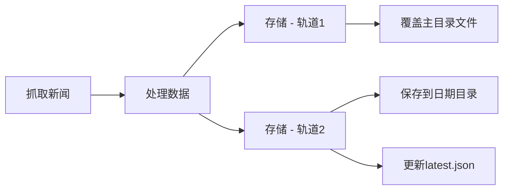

# 📦 双轨存储系统 - 使用指南

## 🎯 功能概述

系统现在采用**双轨存储**策略，同时运行两套存储逻辑：

1. **原有存储逻辑** - 实时覆盖，保持原有行为
2. **历史归档逻辑** - 按日期存储，新增功能

---

## 📂 存储结构

```
data/
├── 2026-01-01/                    # ✨ 新增：历史归档（2026年1月1日）
│   ├── summary.json               # 当天汇总数据
│   ├── www.nejm.org_.json        # NEJM详细数据
│   ├── www.bmj.com_.json         # BMJ详细数据
│   └── ...                       # 其他76个源
│
├── 2026-01-02/                    # ✨ 新增：历史归档（2026年1月2日）
│   ├── summary.json
│   └── ...
│
├── 2026-01-03/                    # ✨ 新增：历史归档（2026年1月3日）
│   └── ...
│
├── summary.json                   # ✅ 原有：最新汇总（每次覆盖）
├── latest.json                    # ✨ 新增：最新数据元信息
├── www.nejm.org_.json            # ✅ 原有：NEJM数据（每次覆盖）
├── www.bmj.com_.json             # ✅ 原有：BMJ数据（每次覆盖）
└── ...                           # ✅ 原有：其他源（每次覆盖）
```

---

## 🔄 工作流程

### 每次定时任务运行时



### 具体执行

```typescript
// 1️⃣ 原有存储逻辑 (saveResults)
data/
├── summary.json          ← 覆盖
├── www.nejm.org_.json   ← 覆盖
└── ...                  ← 覆盖

// 2️⃣ 历史归档逻辑 (saveArchiveResults)
data/
├── 2026-01-03/
│   ├── summary.json     ← 新建（不覆盖）
│   ├── www.nejm.org_.json ← 新建（不覆盖）
│   └── ...
└── latest.json          ← 更新元信息
```

---

## 📊 两套系统对比

| 特性 | 原有存储 | 历史归档 |
|------|----------|----------|
| **函数名** | `saveResults()` | `saveArchiveResults()` |
| **存储位置** | `data/` 主目录 | `data/YYYY-MM-DD/` 子目录 |
| **更新方式** | 每次覆盖 | 按日期新建 |
| **文件内容** | 原始extracted格式 | 扁平化格式 + 日期标记 |
| **历史保留** | ❌ 不保留 | ✅ 永久保留 |
| **主要用途** | 前端实时展示 | 历史查询、数据分析 |
| **兼容性** | ✅ 完全向后兼容 | ✨ 新增功能 |

---

## 🎨 数据格式差异

### 原有存储格式 (data/summary.json)

```json
[
  {
    "url": "https://www.nejm.org",
    "status": "success",
    "title": "The New England Journal of Medicine (NEJM)",
    "articles_count": 25,
    "links_count": 150,
    "from_cache": false,
    "timestamp": 1704249323456
  }
]
```

### 历史归档格式 (data/2026-01-03/summary.json)

```json
[
  {
    "url": "https://www.nejm.org",
    "status": "success",
    "title": "The New England Journal of Medicine (NEJM)",
    "articles_count": 25,
    "links_count": 150,
    "from_cache": false,
    "timestamp": 1704249323456,
    "date": "2026-01-03"           // ← 新增字段
  }
]
```

### 新增 latest.json 格式

```json
{
  "date": "2026-01-03",
  "updated_at": "2026-01-03T08:15:23.456Z",
  "total": 76,
  "successful": 72,
  "failed": 4,
  "results": [...]  // 包含完整的汇总数据
}
```

---

## 💡 使用场景

### 场景1: 前端实时展示（使用原有数据）

```typescript
// 使用主目录的数据，保持原有逻辑不变
fetch('/api/news')  // 或直接读取 data/summary.json
  .then(res => res.json())
  .then(data => {
    // 显示最新新闻
    displayNews(data);
  });
```

**优势：**
- ✅ 无需修改现有前端代码
- ✅ 保持原有性能
- ✅ 100% 向后兼容

---

### 场景2: 历史数据查询（使用归档数据）

```typescript
// 查询某天的历史数据
fetch('/api/archives/2026-01-01/summary')
  .then(res => res.json())
  .then(data => {
    // 显示历史新闻
    displayHistoricalNews(data);
  });
```

---

### 场景3: 混合使用

```typescript
// 1. 首页显示最新数据（原有逻辑）
const latestNews = await fetch('/api/news').then(r => r.json());

// 2. 归档页面显示历史数据（新增功能）
const archiveDates = await fetch('/api/archives/dates').then(r => r.json());

// 3. 获取元信息
const metadata = await fetch('/api/archives/latest').then(r => r.json());
console.log('最后更新时间:', metadata.data.updated_at);
```

---

## 🔌 可用的 API 接口

### 原有接口（保持不变）

```bash
# 获取最新新闻（读取 data/summary.json）
GET /api/news
```

### 新增归档接口

```bash
# 1. 获取所有归档日期
GET /api/archives/dates

# 2. 获取指定日期的汇总
GET /api/archives/2026-01-01/summary

# 3. 获取指定日期的详细数据
GET /api/archives/2026-01-01/details/www.nejm.org_.json

# 4. 获取最新数据元信息
GET /api/archives/latest

# 5. 对比两个日期的数据
GET /api/archives/compare?date1=2026-01-01&date2=2026-01-02
```

详细API文档请参考 [ARCHIVE_GUIDE.md](./ARCHIVE_GUIDE.md)

---

## 🚀 自动运行

### 定时任务执行流程

```typescript
// src/services/scheduler.ts
cron.schedule("0 8 * * *", async () => {
  console.log("Running scheduled news update...");
  
  let newsData = await getAllNews();
  
  // 内部自动执行两套存储：
  // 1️⃣ saveResults(newsData)        - 覆盖主目录
  // 2️⃣ saveArchiveResults(newsData) - 保存到日期目录
  
  console.log("✅ 实时数据已更新");
  console.log("📚 历史归档已保存");
});
```

### 日志输出示例

```bash
开始抓取 76 个URL...
进度: 76/76 (100%) - 速率: 3.04个/秒
请求完成：72个成功 (35个来自缓存)，4个失败

正在提取内容...
结果已保存到 ./data 目录              ← 原有逻辑
📚 历史归档已保存: ./data/2026-01-03    ← 新增逻辑
getAllNews: 25.3s
```

---

## 💾 存储空间管理

### 估算存储空间

```bash
# 单次抓取数据大小约 5-10 MB
# 每天保存一次，一个月约 150-300 MB
# 一年约 1.8-3.6 GB
```

### 查看存储使用情况

```bash
# 查看总大小
du -sh data/

# 查看各日期目录大小
du -sh data/202*

# 统计归档数量
ls -d data/202* | wc -l
```

### 清理策略（可选）

```bash
# 保留最近30天，删除更早的数据
find data/ -type d -name "20*" -mtime +30 -exec rm -rf {} \;

# 或者定期备份后删除
tar -czf backup-2026-01.tar.gz data/2026-01-*/
rm -rf data/2026-01-*/
```

---

## 🛡️ 优势与保障

### ✅ 完全向后兼容

- 原有代码无需修改
- 原有数据格式不变
- 原有API保持不变

### ✅ 独立运行

- 两套逻辑独立执行
- 互不影响
- 归档失败不影响实时数据

### ✅ 灵活扩展

- 可以单独禁用归档功能
- 可以自定义归档策略
- 可以扩展更多归档格式

---

## 🔧 高级配置

### 禁用历史归档（如果需要）

```typescript
// 方法1: 在 getAllNews 中注释掉归档调用
if (mergedOptions.outputDir) {
  await saveResults(processedResults);
  // await saveArchiveResults(processedResults);  // ← 注释掉这行
}

// 方法2: 添加配置选项
const CONFIGS = {
  enableArchive: true,  // 添加开关
  // ...其他配置
};

if (mergedOptions.outputDir) {
  await saveResults(processedResults);
  if (CONFIGS.enableArchive) {
    await saveArchiveResults(processedResults);
  }
}
```

### 自定义归档目录

```typescript
// 修改 getFormattedDate 函数
function getFormattedDate(): string {
  // 按月归档
  return `${year}-${month}`;
  
  // 或按周归档
  const week = getWeekNumber(now);
  return `${year}-W${week}`;
}
```

---

## 📈 监控与日志

### 检查归档是否正常运行

```bash
# 1. 检查最新归档日期
ls -lt data/ | grep '^d' | head -1

# 2. 检查今天的归档是否存在
DATE=$(date +%Y-%m-%d)
ls -la data/$DATE/

# 3. 查看 latest.json 更新时间
cat data/latest.json | grep updated_at
```

### 添加告警（可选）

```typescript
async function saveArchiveResults(results: RequestResult[]): Promise<void> {
  try {
    // ...保存逻辑...
    
    console.log(`📚 历史归档已保存: ${archiveDir}`);
    
    // 发送成功通知（可选）
    // await notifySuccess(dateStr, results.length);
  } catch (error) {
    console.error('❌ 保存归档失败:', error);
    
    // 发送失败告警（可选）
    // await notifyError('Archive failed', error);
  }
}
```

---

## 🎯 总结

### 系统特点

| 特性 | 说明 |
|------|------|
| 🔒 **兼容性** | 100% 向后兼容，不影响现有功能 |
| 📚 **归档** | 自动按日期保存历史数据 |
| 🚀 **性能** | 双轨并行，互不阻塞 |
| 💾 **存储** | 智能管理，可配置清理策略 |
| 🔍 **查询** | 完整的历史数据查询API |
| 🛡️ **安全** | 独立运行，故障隔离 |

### 实际效果

**运行一个月后：**
```
data/
├── 2026-01-01/     ← 1月1日的数据
├── 2026-01-02/     ← 1月2日的数据
├── ...
├── 2026-01-31/     ← 1月31日的数据
├── summary.json    ← 最新数据（1月31日）
└── latest.json     ← 元信息
```

**前端可以：**
- 实时展示最新新闻（使用主目录数据）
- 查看任意历史日期的新闻
- 对比不同日期的数据变化
- 实现日历视图
- 进行数据分析和趋势追踪

---

## 📞 相关文档

- [ARCHIVE_GUIDE.md](./ARCHIVE_GUIDE.md) - 详细的API文档
- [SMS_CONFIG.md](./SMS_CONFIG.md) - 短信服务配置
- [API_SMS_USAGE.md](./API_SMS_USAGE.md) - 验证码API使用

---

**更新时间：** 2026-01-01  
**版本：** 2.1.0 (双轨存储)

